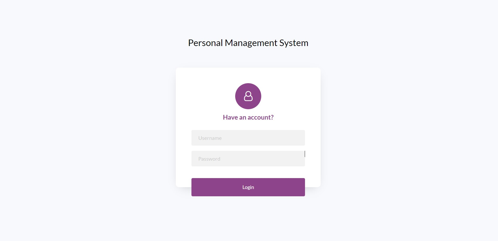
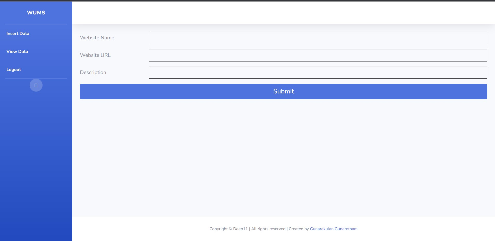
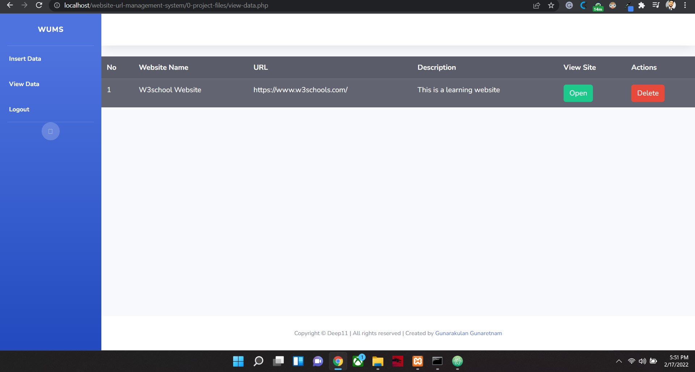

# Website URL Management System

## Introduction

This is a simple management system for maintaining URLs and websites' links. It is not a complete management system. It is developed for a tutorial purpose.

PHP and MySQL are the main technologies for this management system. This system could be used to store information of websites and URLs.

  

## Technologies
- PHP
- MySQL

## Other
- Database is found on the '1-database' folder, upload the database

## Credentials
- Username:- **admin**
- Password:- **admin123**

Any Questions? | Conduct Me
---

* [Linkedin Profile](https://www.linkedin.com/in/gunarakulan-gunaretnam-161119156/)
* [Facebook Profile](https://www.facebook.com/gunarakulan)
* [Twitter Profile](https://twitter.com/gunarakulang)
* [Instagram Profile](https://www.instagram.com/gunarakulan_gunaretnam/)
* [YouTube Channel](https://www.youtube.com/channel/UCMWkED5sabgVZSCKjZuRJXA/videos)
